# StreamHub

OBS ile yayın açılan, Xtream uyumlu oynatıcılardan izlenen çok kiracılı canlı yayın platformu.

- Tasarım: `docs/superpowers/specs/2026-10-05-streamhub-design.md`
- SRS'in ölçülen davranışları: `docs/srs-findings.md`

## Ekran görüntüleri

Yönetim paneli iki role göre açılır: platform yöneticisi yayıncıları ve sunucuları, yayıncı kendi
kanallarını ve izleyicilerini yönetir. Görüntüler deneme verisiyle alınmıştır.

**Yayıncı**

| Genel bakış | Kanallar |
|---|---|
| 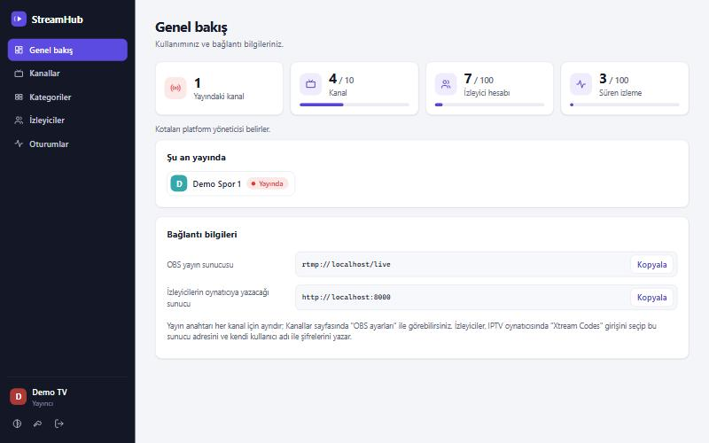 | 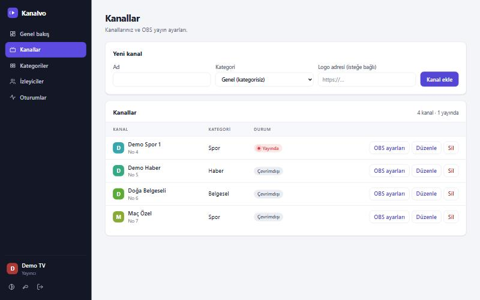 |

| OBS ayarları | İzleyiciler |
|---|---|
| 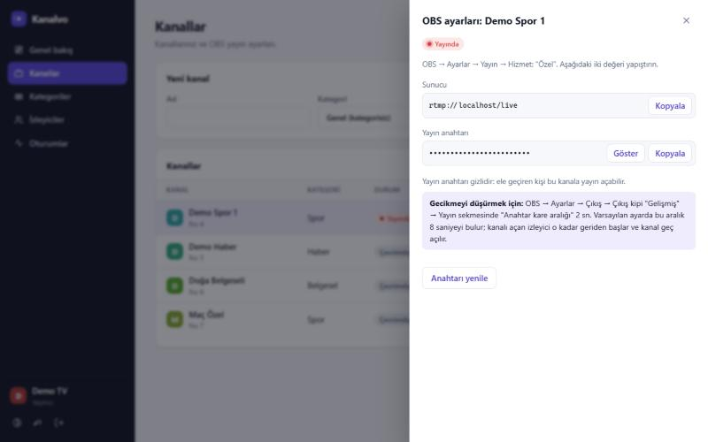 | 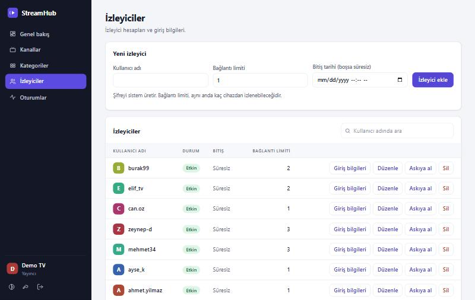 |

| İzleyicinin giriş bilgileri | Süren izlemeler |
|---|---|
| 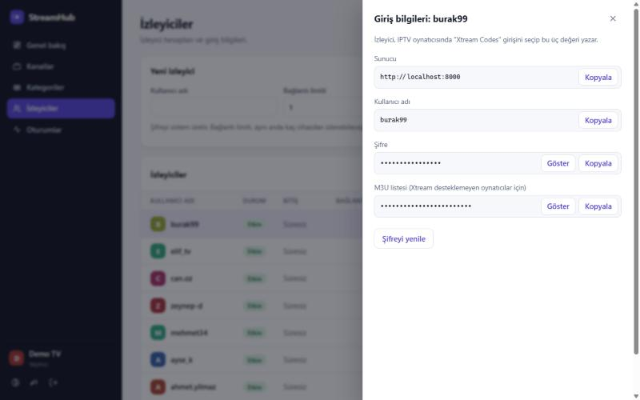 | 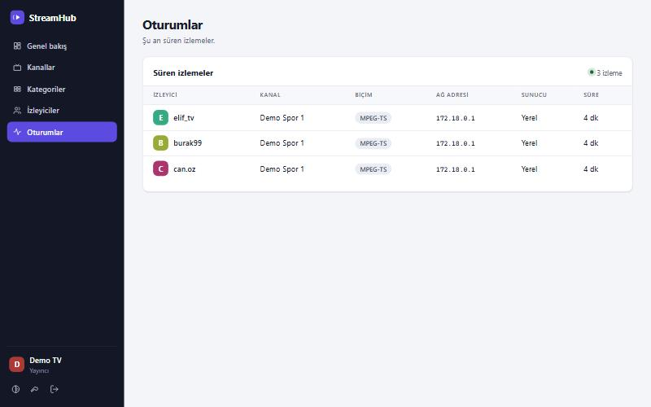 |

**Platform yöneticisi**

| Yayıncılar | Yayıncı ayrıntısı |
|---|---|
| 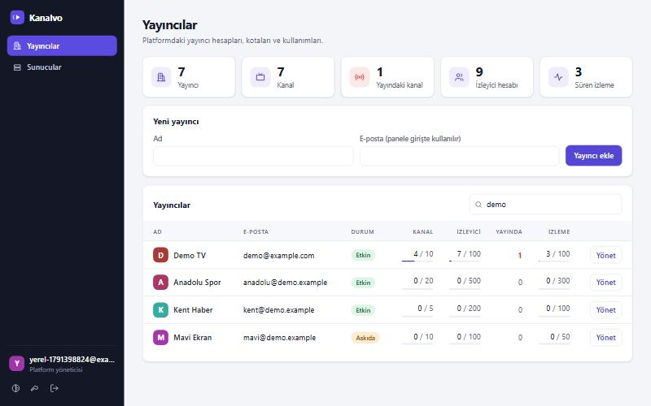 | 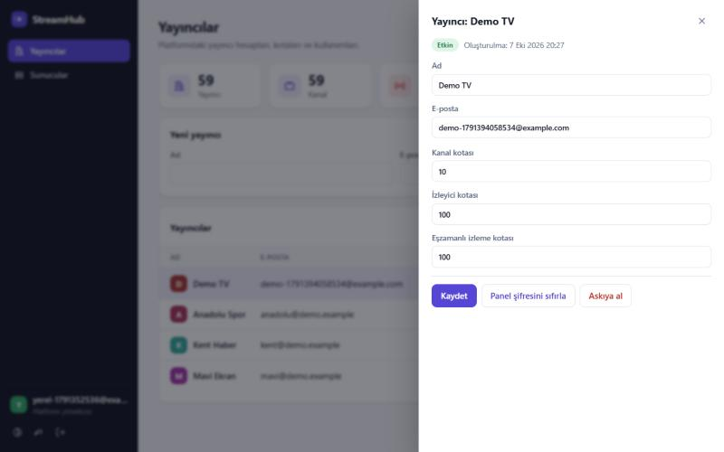 |

| Sunucular | Koyu tema |
|---|---|
| 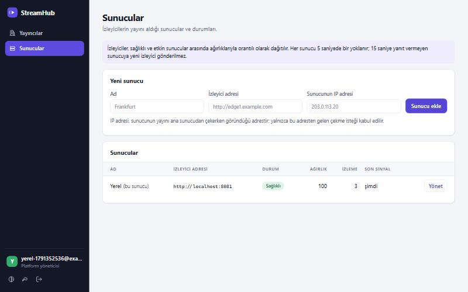 | 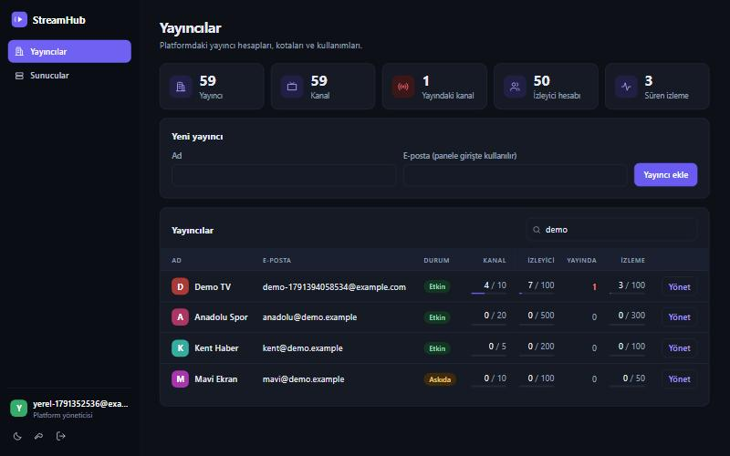 |

| Giriş |
|---|
| 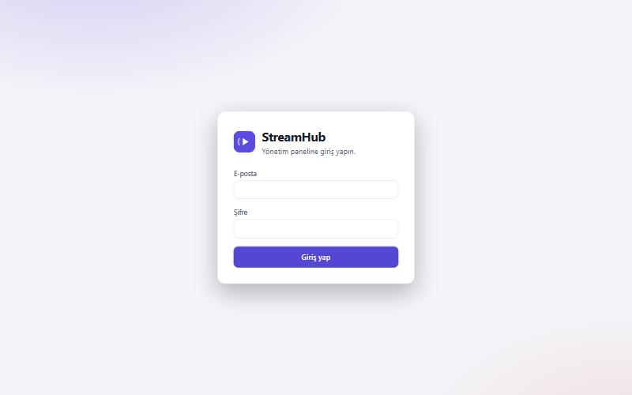 |

## Bileşenler

| Servis | Görevi | Dış port |
|---|---|---|
| `api` | Xtream yayın adresleri ve HLS geçidi (8000); SRS yetki sorguları (8001, yalnızca iç ağ); yönetim paneli (8002) | 8000, 8002 |
| `srs` | OBS'ten RTMP yayını alır, HLS üretir | 1935 |
| `srs-ts` | Kesintisiz MPEG-TS (`.ts`) dağıtır | 8081 |
| `postgres` | Veritabanı | yalnızca 127.0.0.1:5432 |

`srs` servisinin HTTP portu bilerek dışarıya açılmaz: SRS, HLS parçalarını denetimsiz sunar.
HLS izleyiciye yalnızca `api` içindeki `/hls/<imza>/…` geçidinden verilir.

## Yönetim paneli

Panel `http://localhost:8002` adresinde açılır. İlk yöneticiyi komutla oluşturun; şifresi yalnızca bir kez yazılır:

```bash
docker compose exec -T api streamhub create-admin siz@ornek.com
```

Yönetici şifresini unutursanız aynı yolla yenisini alırsınız; açık oturumları kapanır:

```bash
docker compose exec -T api streamhub reset-admin-password siz@ornek.com
```

- **Yönetici** yayıncı ekler, kotalarını belirler, askıya alır ve panel şifresini sıfırlar; izleyicilerin
  dağıtıldığı sunucuları yönetir.
- **Yayıncı** kendi kanallarını, kategorilerini ve izleyicilerini yönetir; OBS ayarlarını ve izleyicinin
  giriş bilgilerini kopyalar; süren izlemeleri görür.

Sunucuda paneli (8002) yalnızca HTTPS sunan bir vekilin arkasından yayınlayın ve `.env` içinde:

- `PANEL_INSECURE_COOKIE` satırını silin; aksi halde giriş çerezi şifresiz bağlantıdan da gönderilir.
- `PANEL_TRUST_PROXY_HEADERS=true` yapın; aksi halde tüm girişler vekilin adresinden geliyor görünür ve
  birinin 20 hatalı girişi herkesi panelin dışında bırakır. Bu ayar izleyici uçlarının
  `TRUST_PROXY_HEADERS` ayarından bağımsızdır.

Arayüzün kaynağı `web/` klasöründedir ve Docker imajı oluşturulurken derlenir. Arayüz üzerinde
çalışırken `cd web && npm install && npm run dev` ile geliştirme sunucusunu açabilirsiniz; API
istekleri çalışan panele aktarılır.

## Yerelde çalıştırma

Docker ve Docker Compose v2 gerekir.

```bash
cp .env.example .env
docker compose up -d --build --wait
docker compose exec -T api streamhub seed-dev
```

`seed-dev` bir deneme yayıncısı, kanalı ve izleyicisi oluşturur ve değerlerini yazar:

- OBS → Ayarlar → Yayın → Özel: sunucu `rtmp://localhost/live`, yayın anahtarı `<channel_id>?secret=<stream_secret>`
- OBS'te gecikmeyi düşürmek için: Ayarlar → Çıkış → Çıkış kipi "Gelişmiş" → Yayın → "Anahtar kare aralığı" 2 sn.
  Varsayılan ayarda aralık yaklaşık 8 saniyedir; yeni izleyici son anahtar kareden başladığı için o kadar geriden izler.
- IPTV oynatıcısı (TiviMate, IPTV Smarters vb.) → "Xtream Codes" girişi: sunucu `http://localhost:8000`, kullanıcı adı `<username>`, şifre `<password>`
- M3U listesi: `http://localhost:8000/get.php?username=<username>&password=<password>&type=m3u_plus&output=ts`
- Doğrudan izleme: `http://localhost:8000/live/<username>/<password>/<channel_id>.ts` (veya `.m3u8`)

Telefondaki veya televizyondaki bir oynatıcıdan denemek için `.env` içindeki `PUBLIC_BASE_URL`,
`EDGE_TS_BASE_URL` ve `EDGE_HLS_BASE_URL` adreslerinde `localhost` yerine bilgisayarın ağ adresini yazın.

## İkinci sunucu (edge) ekleme

İzleyiciler birden fazla sunucuya dağıtılabilir. Ana sunucudaki dağıtım "Yerel" adıyla hazır gelir;
yeni bir sunucu eklemek için:

1. Panelde **Sunucular** sayfasında **Sunucu ekle**'ye basın. Panel tek kullanımlık bir kurulum
   komutu gösterir (30 dakika geçerlidir):

   ```bash
   curl -fsSL http://tv.example.com:8000/edge/install/<kod> | sudo sh
   ```

2. Komutu yeni sunucuda (Linux) çalıştırın. Betik Docker yoksa kurar, dosyaları
   `/opt/streamhub-edge` altına yazar, sunucuyu ana sunucuya kaydeder ve servisleri başlatır.
   İzleyicilere 80 numaralı port açılır; başka bir port için komutun sonunu
   `| sudo EDGE_PORT=8080 sh` yapın.
3. Panel sunucunun bağlandığını kendiliğinden görür ve adını, izleyici adresini sorar. Adres,
   sunucunun bağlandığı IP ile dolu gelir; alan adınız varsa değiştirin. **Sunucuyu ekle** deyince
   sunucu izleyici almaya başlar. Onaylanmayan sunucu listede "Devre dışı" bekler.

| Komut | Onay |
|---|---|
| 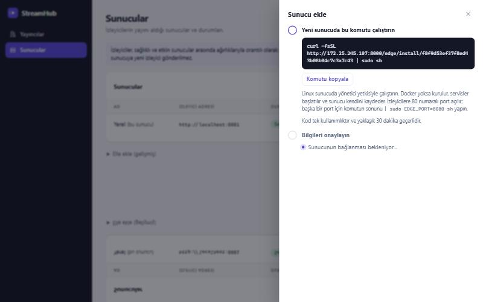 | 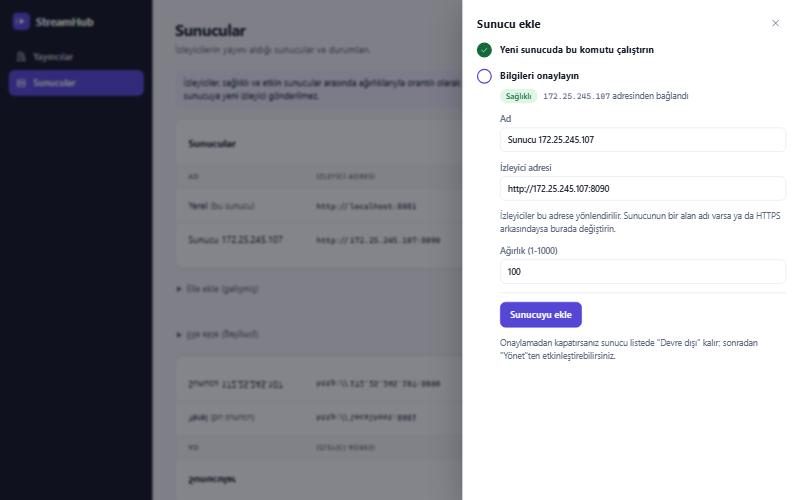 |

Sunucuyu kaldırmak için orada `sudo sh /opt/streamhub-edge/kaldir.sh` çalıştırın ve paneldeki kaydı
silin. Kurulumu elle yapmak isterseniz (ör. betik çalıştıramadığınız bir ortamda) aynı sayfadaki
"Elle ekle" bölümü sunucuyu kaydeder ve `deploy/edge` klasöründeki dosyalarla birlikte `.env`
dosyasına yazılacak satırları verir.

Bilinmesi gerekenler:

- Yeni sunucu, ana sunucunun izleyici portuna (8000) ve RTMP portuna (1935) ulaşabilmelidir; ana
  sunucu da yeni sunucunun izleyici portuna ulaşabilmelidir. Başka port açmak gerekmez.
- İzleyiciler sağlıklı ve etkin sunuculara ağırlıklarıyla orantılı dağıtılır. Bir sunucu 15 saniye
  yanıt vermezse yeni izleyici almaz; yanıt verince yeniden alır.
- Bir sunucuyu kaldırmadan önce devre dışı bırakın ve izlemelerinin bitmesini bekleyin: silinen
  sunucuda süren izlemeler kesilmez.
- Sunucunun anahtarı ve ana sunucuyla arasındaki denetim trafiği HTTP ile açık taşınır. İki sunucu
  arasında özel ağ kullanın ya da `CONTROL_URL` ve sunucunun "yönetim adresi" için HTTPS adresleri
  verin. `CONTROL_URL` için HTTPS adresi uçtan uca denendi (izleme, kesme, HLS). Yeni sunucu ana
  sunucunun sertifikasını doğrulamaz: trafik şifrelenir ama araya giren biri kendini ana sunucu
  gibi tanıtabilir; güvenilmeyen ağlarda özel ağ kullanın.
- Kurulum komutu ana sunucunun izleyici adresinden (`PUBLIC_BASE_URL`) indirilir; bu adres HTTP ise
  betik ve sunucunun anahtarı açık taşınır. Kod tek kullanımlıktır: kaydolan sunucunun anahtarı
  komutta ya da kabuk geçmişinde kalmaz.
- Ana sunucu, kurulum isteğinin geldiği IP adresini sunucunun adresi sayar ve yayını yalnızca bu
  adresten çekmesine izin verir. Sunucu yayını başka bir adresten çekiyorsa (birden çok ağ arayüzü,
  NAT) izleyiciler yönlendirilir ama görüntü gelmez; "Yönet" penceresinde "Sunucunun IP adresi"ni
  düzeltin. Ana sunucu bir vekilin arkasındaysa `TRUST_PROXY_HEADERS` açık olmalıdır, aksi halde
  vekilin adresi kaydedilir.
- Yeni sunucuda veritabanı ya da imza anahtarı bulunmaz; her izlemeyi ana sunucu yetkilendirir. Ana
  sunucu durursa hiçbir sunucudan yeni izleme başlatılamaz.

## Bağlantı limiti ve askıya alma

- Her izleyicinin bir bağlantı limiti vardır (`seed-dev` ile oluşturulan izleyicide 1). Limit doluyken
  yeni bir izleme başlarsa en eski izleme kesilir; böylece kanal değiştiren izleyici beklemez,
  hesabını paylaşanlar ise birbirini düşürür.
- Bir HLS adresi aynı anda tek bir ağdan kullanılabilir. Başka ağdan açılırsa oturum oraya taşınır
  (ağ değiştiren izleyici devam eder) ve 1 dakika dolmadan geri taşınamaz.
- Yayıncının toplam bağlantı kotası doluysa yeni izleyici reddedilir (kimse düşürülmez).
- Bir yayıncıyı askıya almak için:

  ```bash
  docker compose exec -T api streamhub set-tenant-status <tenant_id> suspended
  ```

  Süren yayınları ve izleyicilerinin bağlantıları birkaç saniye içinde kesilir. Geri almak için
  `active` yazın.
- Yeni yayıncıların varsayılan kotaları: 10 kanal, 100 izleyici, 100 eşzamanlı bağlantı. Bu sürüme
  güncellenen mevcut yayıncılar da aynı değerleri alır.

## Ayarlar

| Değişken | Anlamı | Varsayılan |
|---|---|---|
| `PUBLIC_BASE_URL` | Oynatıcıya girilen sunucu adresi; M3U adresleri bundan üretilir | zorunlu |
| `EDGE_TS_BASE_URL`, `EDGE_HLS_BASE_URL` | Ana sunucunun ("Yerel" edge) izleyiciye verdiği `.ts` ve HLS adresleri | zorunlu |
| `LOGIN_MAX_FAILURES`, `LOGIN_FAILURE_WINDOW` | Bir IP bu sürede bu kadar hatalı giriş yaparsa süre bitene kadar 429 alır | 20, 5m |
| `TRUST_PROXY_HEADERS` | İstemci IP'sini `X-Forwarded-For` başlığının son değerinden alır. Yalnızca API bu başlığı yazan bir vekilin arkasındayken açın; aksi halde giriş sınırı atlatılabilir | false |
| `TOKEN_TTL`, `HLS_TOKEN_TTL` | `.ts` ve HLS imzalarının ömrü | 5m, 6h |
| `INGEST_BASE_URL` | Yayıncıların OBS'e yazacağı sunucu adresi; panelde gösterilir | zorunlu |
| `PANEL_SESSION_TTL` | Panel oturumunun ömrü | 12h |
| `PANEL_INSECURE_COOKIE` | Panel çerezinin HTTP üzerinden de gönderilmesine izin verir; yalnızca yerel geliştirme için | false |
| `PANEL_TRUST_PROXY_HEADERS` | Panel isteklerinde istemci IP'sini `X-Forwarded-For` başlığından alır; panel vekil arkasındaysa açın | false |

`.env.example` içindeki değerler yalnızca yerel geliştirme içindir; sunucuda `TOKEN_KEY` ve
`HOOK_SECRET` için yeni rastgele değerler üretin ve `EDGE_*` adreslerini dış alan adınıza göre ayarlayın.

## Testler

```bash
docker compose up -d postgres
go test -p 1 ./...
```

Paketler aynı test veritabanını paylaştığı için `-p 1` gereklidir.

Uçtan uca test (tüm servisler çalışırken; sahte yayını FFmpeg kapsayıcısı gönderir):

```bash
docker compose up -d --build --wait
go test -tags e2e -count=1 ./e2e/
```

Uçtan uca test, ikinci sunucuyu `deploy/edge` dosyalarıyla aynı makinede ayrı bir Compose projesi
olarak (8090 portunda) başlatır ve sonunda kaldırır.
